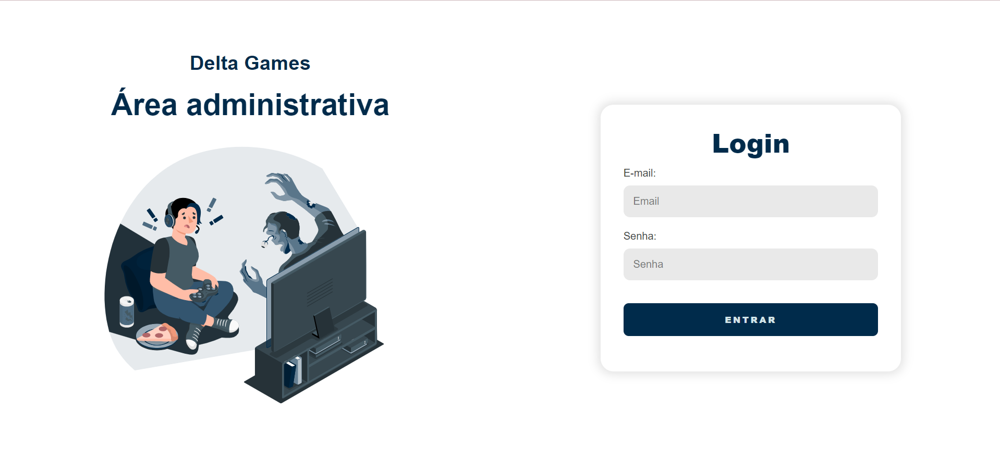
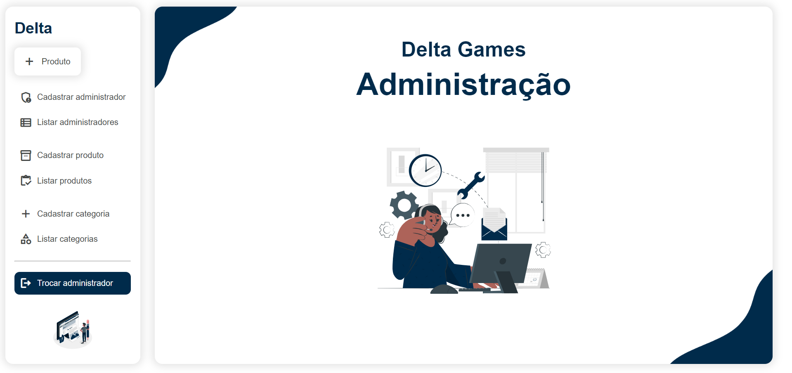
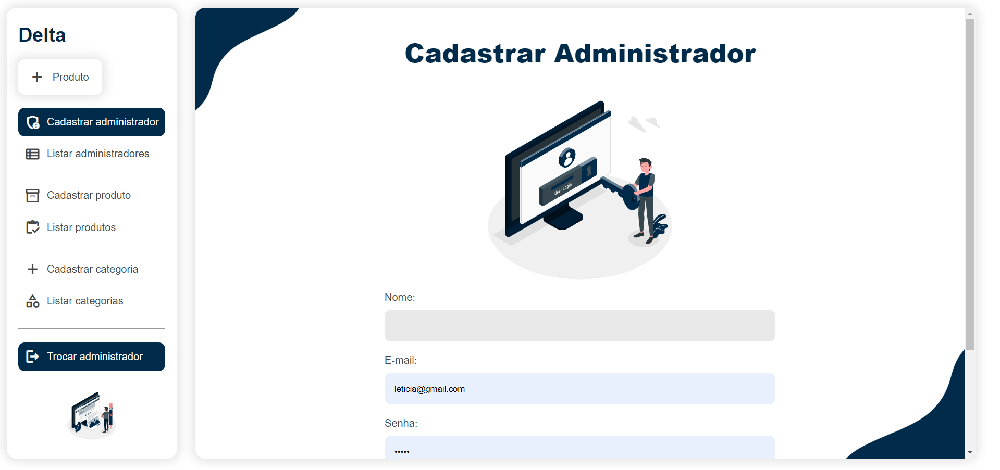
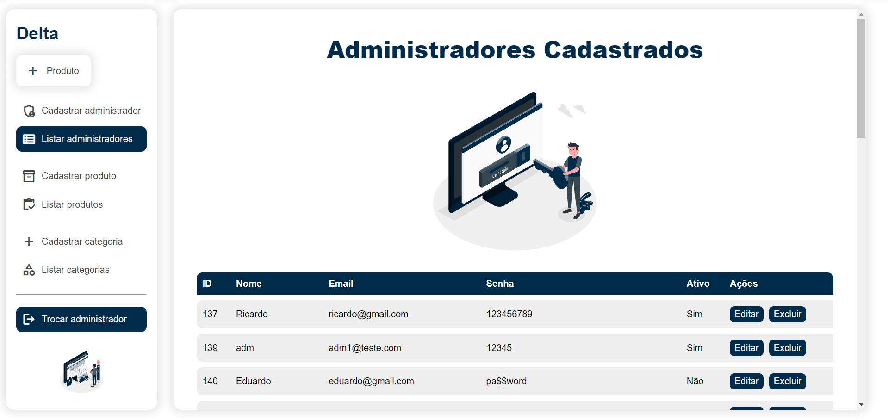
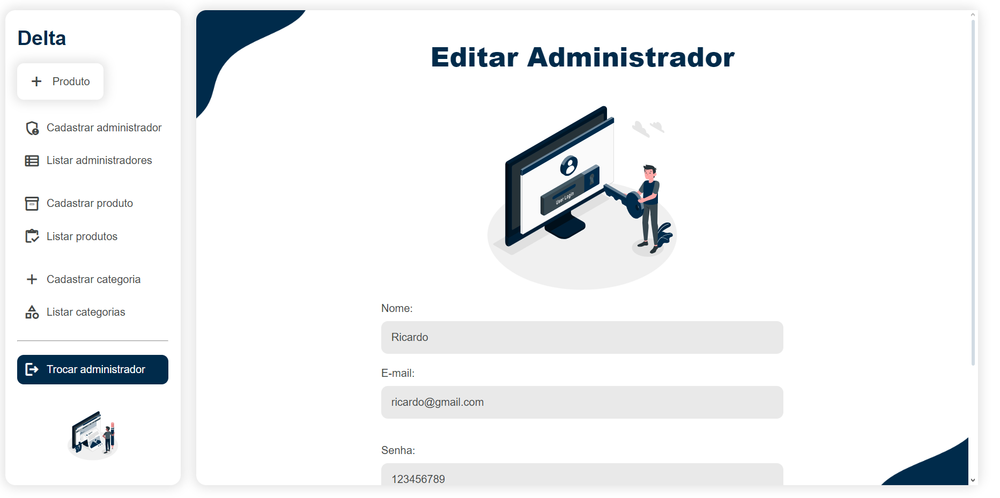
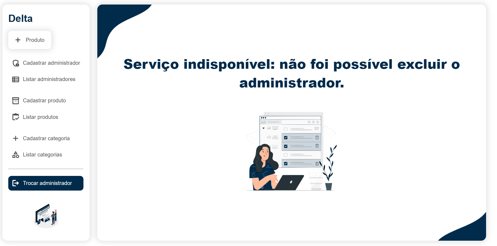

# CRUD Delta
> CRUD desenvolvido como parte da disciplina de Projeto Integrador do curso de Sistemas para Internet da minha faculdade.

## `Skills utilizadas:`
* PHP, SQL, JavaScript, HTML e CSS

## `Funcionalidades:`
* Servir como parte administrativa de uma empresa de jogos (DELTA).

### Principais funcionalidades:

* **CADASTRAR** administrador / categoria / produto.
* **EDITAR** informações do(a) administrador / categoria / produto.
* **EXCLUIR** administrador / categoria / produto.
* Sistema de **LOGIN** do administrador.

## `Páginas:`

### Página de Login:
* Aqui é onde o administrador vai entrar com sua conta ativa, caso a conta esteja desativada não será possível efetuar o login.
  

### Página Inicial do Administrador:
* Nesta sessão já é possível observar as funcionalidades do site que estão dispostas em um sidebar.
* Como observado o produto, categoria e admnistrador tem seus próprios CRUDs.

### Página de Cadastro:
* O formulário deverá ser preenchido com as informações correspondentes do ítem que se quer cadastrar.

### Página de Listagem:
* Todos os itens cadastrados aparecerão nesta sessão, junto as funções de editar e excluir.
  

### Página de Editar:
* Aqui é onde será possível alterar todas as informações dos item cadastrado.

### Página de Excluir:
* Aqui aparecerá uma mensagem caso o item tenha sido excluido com sucesso ou não.

